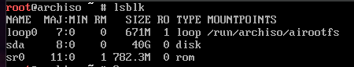

# Arch Linux O'rnatish

Ushbu qo'llanmada Arch Linux tizimini VPS/VDS serverlariga o'rnatish va uni sozlash bo'yicha ma'lumot va amaliy ko'nikma olishingiz mumkun

Keling endi 1-o'rinda Arch Linuxni yuklab olaylik. Agar siz O'zbekistonda bo'lsangiz va Server ham O'zbekistonda bo'lsa sizga Uzinfocom Data Markazidan iso faylni yuklab olishingizni tavsiya qilaman. Havola: [http://mirror.dc.uz/arch-iso/](http://mirror.dc.uz/arch-iso/)

Menimcha Siz server olgan provayder sizga iso obrazni yuklab beradi. Agar siz provayderni mas'ul hodimi bo'lsangiz unda sizga ushbu bo'lim kerak:

## ISO FAYLNI USBGA YOZISH

Agar siz Linux/UNIX tizimidan foydalansangiz sizga `dd` buyrug'i yordam beradi. Aytaylik sizda `archlinux-2022-10-02-x86_64.iso` nomli fayl bo'lsin va USB qurilmangiz `/dev/sdb` deb nomlangan bo'lsin. Bunday holatda iso fayl turgan jildga Terminalni ochasiz va ushbu buyruqni kiritasiz

```
sudo dd if=/dev/sda of=./archlinux-2022-10-02-x86_64.iso BS=4MB status=progress
```

Agar sizda Windows tizimi bo'lsa sizga Balena Etcher dasturdan foydalanishni tavsiya qilaman. Havola: [https://balena.io/etcher](https://balena.io/etcher) (ushbu saytda foydalanish haqida qo'llanma ham bor)

## O'RNATISH JARAYONI

### BOOT MENU, USBDAN YUKLASH

Tayyor usbni serverga ulang va Boot Menudan usbni tanlab enter bosing

Agar sizda barchasi to'gri bo'lgan bo'lsa ushbu oyna chiqadi:

.png>)

### DISKLAR

Katta ehtimol bilan VPS/VDSlar MBR disk strukturasida ishlaydi. Shuning uchun MBR orqali o'rnatishni tushuntiraman.

Endi disklarni bo'lib olish kerak. Buning uchun avval `lsblk` buyrug'idan foydalanib disklarni ko'rib olish kerak:



Ko'rib turganingizday menda `sda` nomi bilan bitta disk bor, sizlarda `vda`,`xvda` nomlari bilan nomlangan bo'lishi mumkun. Agar sizda nvme disk bo'lsa `nvme0n1`  nomi bilan ham yozilishi mumkun. Endi uni 2 qismga bo'lib olish kerak. Bular kamida 1GB swap tizimi uchun, qolgani esa operatsion tizim uchun. Disklarni bo'lishda `cfdisk` utilitasidan foydalanishni tavsiya qilaman:

```
cfdisk /dev/sda  #Sizda /dev/vda /dev/xvda yoki /dev/nvme0n1 bo'lishi ham mumkun
```

Hosil bo'ladigan oynadan dos turini belgilaymiz va enter bosamiz. Endi disklarni bo'lish kerak.

.png>)

disklar shunday bo'linishi kerak. Menda 40GB joy bor. Menu uni 1GB SWAP uchun qolgan 39GBni esa ROOT yoki Tizim uchun bo'ldim. `cfdisk` utilitasidan foydalanib disklarni bo'lish haqida batafsil hali maqola ishlab yozaman.&#x20;

Endi Write degan joyda kelib enter bosamiz va yes deb yozib yana bir bor enter bosib so'ngra q harfini bosib chiqib ketamiz.&#x20;

Yuqorida aytib o'tgan `lsblk` yordamida hosil bo'lgan disklarni ko'rib olamiz.

.png>)

Endi bizda 2 ta disk bor. Ularni formatlash va kerakli jildlarga ulash kerak. Endi buyurqlarni yozib boraman. U yerda o'zingiz to'girlashingiz mumkun bo'lgan parametrlarga bellgi ham qoldirib ketaman.

## FORMATLASH

Endi Navbat Formatllashga

yuqorida aytganimday sizda sda emas boshqacha bo'lishi mumkun. sda, vda, xvda Xda deyali bir xil. Faqat harflarda faqr qiladi. nvme esa bir oz boshqacha masalan: `/dev/nvme0n1p1` yoki `/dev/nvme0n1p2`  bunda `nvme0` nvme disk ekanligini, n esa server yoki kompyuterdagi fizik nvmening tartib raqamini ifodalasa, p esa shu diskning logik qismlarini tartib raqamini bildiradi.

```
mkswap /dev/sda1 # swap uchun disk formatlash
mkfs.ext4 /dev/sda2 # tizim uchun disk formatlandi
```

.png>)

Disklarimiz formatlandi!

## DISKLARNI ULASH

Endi biz disklarimizni ulaymiz, ya'ni tizim o'rnatish uchun bog'laymiz.

```
swapon /dev/sda1 # SWAP diskni ulash
mount /dev/sda2 /mnt # asosiy diskni ulash
```

.png>)

Disklar bog'landi

## TARMOQ, INTERNETGA ULANISH

Arch Linux tizimini o'rnatish uchun internetga ulangan bo'lishingiz kerak

Sizga tavsiya beraman simli tarmoqqa ulaning. Ya'ni LAN orqali ulaning. Menimcha server hech kim WIFIga ulanib tizim o'rnatmasa kerak

## REPOZITORIYANI SOZLASH

Operatsion tizimning bootstrap faylllarini yuklab olishimiz kerak. Buing uchun biza eng yaqin davlat yoki Biz turgan davlatni mirrori kerak. Ko'plab davlatlar qatori O'zbekistonni ham mirror ya'ni repozitoriya oyasi mavjud

```
reflector -c Uzbekistan a 24 --sort rate --save /etc/pacman.d/mirrorlist # Men O'zbekistondaman...
```

Demak ozgina kutamiz va Yangi qator ochilsa davom etamiz

## O'RNATISH BOSQICHI

O'rnatish uchun hamma narsani sozlab oldik. Eni o'rnatamiz

Bizga Linux kernel fayllari, proshivkalar va bootstrap fayllar kerak. Ularni yuklab olib o'rnatamiz

```
pacstrap /mnt base base-deve linux linux-firmware linux-headers # va enter bosamiz))
```

Bu jarayon bir necha daqiqa vaqt olishi mumkun. Shuning uchun kutamiz va Yangi qator ochilishi bilan davom etamiz.

Endi chroot yordamida "yarim tayyor" tizimizga kiramiz

```
arch-chroot /mnt # Enter bosing ....
```

Sizda katta ehtimol bilan `root@archiso ~ #` deb yozilgan yangi qator ochildi. Endi o'zimiz uchun foydalanuvchi yaratamiz, unga parol o'rnatamiz, root uchun ham parol o'rnatamiz

```
passwd # shunchakishuni yozin enter ba parol yozamiz. Parol ko'rinmaydi. Ikki qayta teramiz
useradd -m -G wheel anvar # o'zimizga user yaratamiz. Men user nmini anvar deb atadim
passwd anvar # anvar uchun parol yozamiz huddo passwddagiday
```

Endi bizga editor kerak

`sudo pacman -S micro`

Men micro editordan foydalanaman. Siz nano, vim yoki helix ishlatishingiz mumkun... Micro ishlatishimni sababi uni hotkeylari oddiy notepaddagiday...

Sizda CPU qanaqa?

Intel? `sudo pacman -S intel-ucode`&#x20;

AMD? `sudo pacman -S amd-ucode`&#x20;

Bo'ldimi?

Endi navbat vaqt va sanani sozlashga

`hwclock --systohc --utc`

`ln -sf /usr/share/zoneinfo/Asia/Tashkent /etc/localtime`

Men Toshkentda yashayman shuning uchun Toshkenti yozdim.

hostnameni sozlash vaqti keldi

`echo "arch" > /etc/hostname`  Men hostimga arch deb nom berishqa qaror qildim. Siz o'zingiz istgan bitta so'zni yozishingz mumkun.

Endi hostsni sozlash kerak

`echo "127.0.0.1    localhost" >> /etc/hosts`

`echo "::1    localhost" >> /etc/hosts`

`echo "127.0.1.1    arch.localdomain    arch" >> /etc/hosts`

&#x20;Oxirda kiritilgan buyruqda arch o'rniga o'zingiz kirgan hostnameni yozasiz

Tarmoq utilitalarini o'rnatishimiz kerak bu universal. Shunchaki shu comandalarni yozing va o'rnating:

`sudo pacman -S networkmanager nectl wpa_supplicant openssh dhcpcd firewalld ufw` ... O'rnatildimi? Ha bo'lsa davom etamiz

`EDITOR=micro visudo`  menda aytganimda micro sizda siz xoxlaganingiz. Chiqqan codlarga `%wheel ALL=(ALL:ALL) ALL` degan jumlani qidirib topamiz. Bu pastda. Uni oldida #ni olib tashlab saqlab chiqib ketamiz.&#x20;

Bu siz yaratgan user ham root huquqdan foydalana olishi uchun.

Endi til tanlashimiz kerak. Menga ingliz tili ma'qul sizlarga ham shuni tavsiya qilaman.

Demak `micro /etc/locale.gen` ha hosil bo'lgan oyadan O'zimizga keagini topamiz. Ingliz tili `en_US.UTF-8 UTF-8` deb nomlangan. Uni oldidagi #ni olib tashlab izohdan olamiz. Faylni saqlaymiz va undan chiqamiz. Endi shu tilni tizim tili etib tayinlaymiz

`echo "LANG=en_US.UTF-8" > /etc/locale.conf`

`locale-gen`

Demak til tanlandi.&#x20;

Endi navbat systemd xizmarlarini yoqib qo'yshga.&#x20;

Biz boshida dhcpcd, openssh va wpa\_supplicant paketlarini o'rnatgan edik. Endi uni ishga tushuramiz.

`sudo systemctl enable NetworkManager wpa_supplicant sshd dhcpcd`

Agar muvafaqqiyatli bo'lgan bo'lsa, endi yuklovchi-bootloaderga navbat

`sudo pacman -S gub dosfstools mtools os-prober`

O'rnatildimi? Endi grubni operatsion tizimni yuklash uchun sozlaymiz. Bundan yoqrida aytganimday disk nomi bilan amalga oshiramiz. Eslatib o'taman: Menda /dev/sda!!!

`grub-install --target=i386-pc /dev/sda`

`grub-mkconfig -o /boot/grub/grub.cfg`

Tayyor. Endi operatsion tizim o'rnatildi.

Endi diskarni uzish va tizimni ishga tushurishimiz qoldi

`umount -a`

`reboot`


### Agar sizda barchasi o'xshagan bo'lsa Tabriklayman. Agar nimadir xatolikga duch kelsangiz Telegram guruhimizga bog'laning

@Xinux @Anvar\_Alimov 2022 2-noyabr
